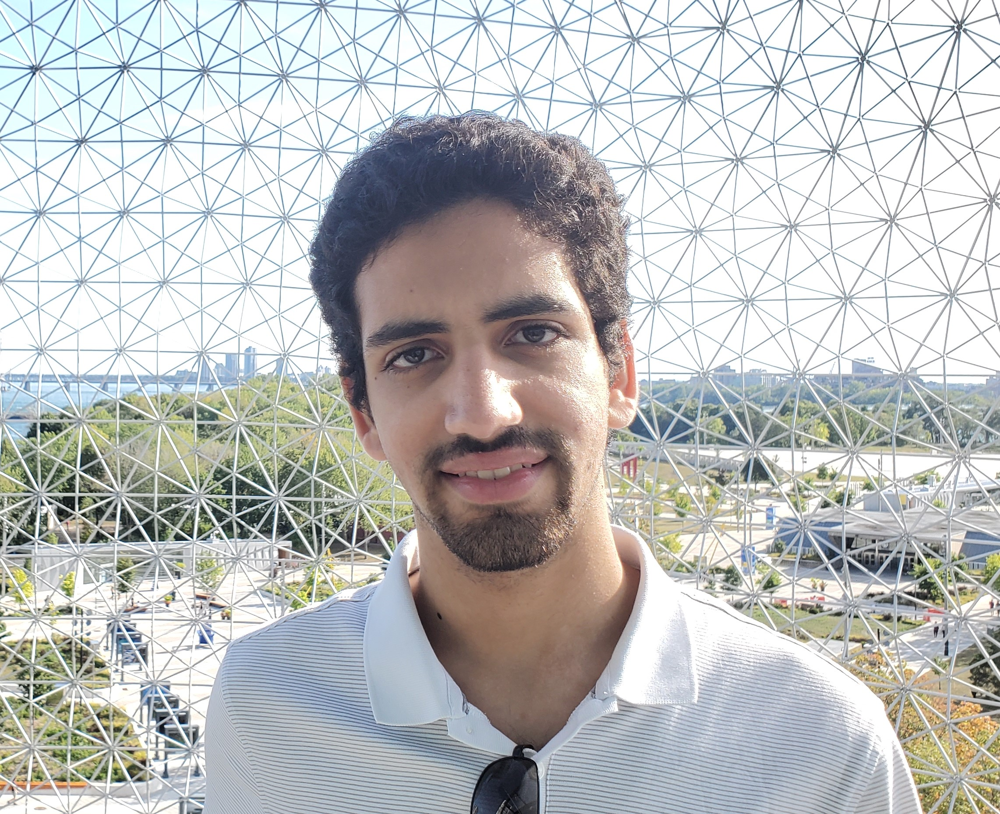

Hi! I'm Mohamed Moussa, a third year Computer Science Software Engineering Specialist Co-op student at the University of Toronto.

My first hands-on experience was at Hack the Valley IV, where I worked with 3 developers to build and deploy a fully functional web application.
As this hackathon was my first step towards web development,
I continued to build upon the skills I learned and can now develop web applications with the MERN stack.

In terms of work experience, I completed an 8-month work term at the Ministry of Health as an Application Developer.
Through this experience I worked with PL/SQL, ETL, and cloud technologies, such as Azure.
I also learned how to navigate in a work environment and provide the best results.

Through university, work experience, and side projects, I have gathered experience with Java, Python, C,
HTML, CSS, JavaScript, REST, MVC, Agile Development, SQL and NoSQL databases.

In my free time, I like to increase my knowledge on the latest technologies, play piano and guitar, and skate.
