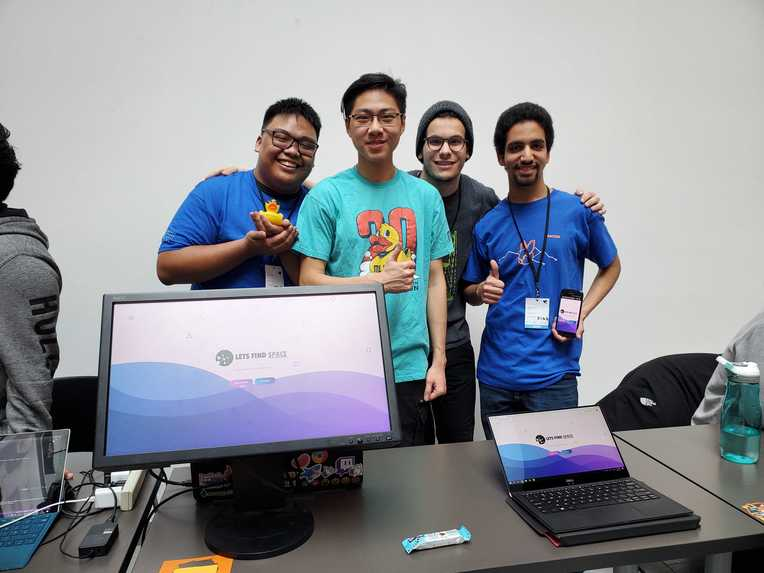

Going to Hack The Valley IV was my first step towards web development; I was really excited to hone my skills and learn new ones.

I formed a team of four developers and brainstormed until we came up with the idea of Let's Find Space.

The idea is to help groups of people to find a convenient place to meet such that none of them have to make an unfair commute.

**Technologies**: Google APIs, React, NodeJS, MongoDB, Express, Heroku

**Time Constraint**: 48 hours

More information is on [Devpost](https://devpost.com/software/lets-find-space)

**Github**: [LetsFindSpace Repo](https://github.com/Garciat427/LetsFindSpace)

